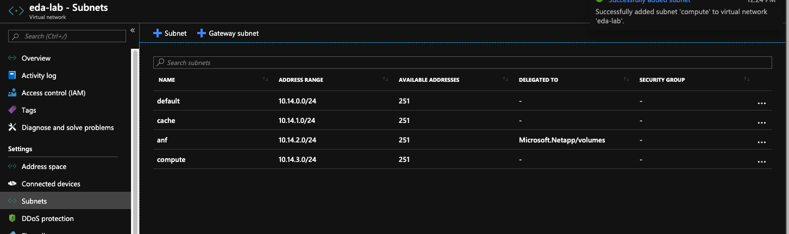
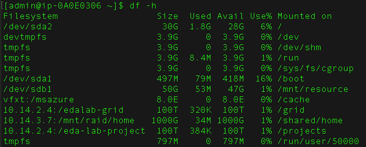

# EDA HPC Lab

This lab provides instruction for setting up an EDA HPC environment.  The architecture
of this environment follows a pattern of success used for critical workloads.  

Filesystems are commonly a performance bottleneck in EDA workflows so
filesystem configuration should be carefully considered.  We'll be deploying 
a well-tread solution which uses a mix of large IOPS filesystems and large read throughput. 
Four NFS filesystem mounts will be used, with three different filesystem types.

* Netapp Volume for Scheduler Spool
* Netapp Volume EDA Projects Directory
* Avere HPC Cache for tools
* NFS Fileshare for home directory

## Setup Virtual Network

Prepare a new subnet for this lab. The storage solutions require specific configurations.
We'll make four subnets in a vnet.

* default
* compute
  * Enable Microsoft.Storage Service Endpoint
* cache
  * Enable Microsoft.Storage Service Endpoint
* anf
  * Delegate to Microsoft.Netapp/volumes

These configurations are applied to the vnet shown.

 

## Setup Avere vFXT Cache

Avere vFXT is supported in a community project hosted in GitHub and available
[here](https://github.com/Azure/cyclecloud-vFXT). Follow the README instructions
in the _cyclecloud-vFXT_ project to deploy a vFXT cluster into the cache subnet, and use the compute subnet for the vFXT clients.


## Setup Azure Netapp Files

In this environment we'll use one Netapp pool and create two volumes. One volume will be used for scratch (50TB) and the other for scheduler spool directories (5TB).

The volume creation process is documented [here](https://docs.microsoft.com/en-us/azure/azure-netapp-files/azure-netapp-files-create-volumes). Be sure to 
specify the _anf_ subnet created in an earlier step.


## Setup compute cluster

### Upload the *edalab* project

The *edalab* cyclecloud project sets up a few IO benchmarking tools
including _ior_ and _fio_. _ior_ relies on _mpirun_ which is why the
_HPC-_ variant of CentOS is used.

```bash
cd edalab
cyclecloud project upload
```

### Modify the cluster template to use the vFXT and ANF file shares

The compute cluster for this environment is defined in the [cluster template](templates/grid.txt) which has all of the filesystem mounts.

Import the cluster template

```bash
cyclecloud import_cluster edalab -c grid -f grid.txt -c eda
```

Add the _edalab_ cluster type that was just imported and fill out the create menu 
specifying the vFXT cluster name, the ANF volume address, and
the export directories of the ANF volumes.


Once these values are saved the cluster is ready to start. Start the cluster
and wait for the master node to be ready.

### Inspect the Filesystems

Connect to the master node by using the _cyclecloud_ command line:

```bash
cyclecloud connect master -c edalab-grid
```

Once logged-in view the filesystem properties 



The external filesystems are mounted to _/grid_, _/cache_, _/projects_ and _/homes_. These mounts are a common filesystem pattern for EDA where:

* Home directories - durable, IOPS performant
* Projects - large IO performance
* Cache - cache-able data such as tools and compilers
* Grid - durable, IOPS performant

## Run IO Benchmarks

Use the grid cluster to benchmark the various filesystems mounted by
the cluster.

Copy this script to your home directory on the cluster in a file named _io.sh_.

```bash
#!/bin/bash
DATE_STAMP=`date +"%Y-%m-%d_%H-%M-%S"`
WORK_DIR=$1/test_${DATE_STAMP}
mkdir -p $WORK_DIR

SOFTWARE_DIR=/cache/software/ior/bin/
source /etc/profile.d/modules.sh
module load mpi/openmpi-4.0.1


IOAPI=POSIX
BLOCKSIZE=256M
mpirun $SOFTWARE_DIR/ior -a $IOAPI -B -w -r -k -z -v -o $WORK_DIR -i 2 -m -t 32m -b $BLOCKSIZE -d 1 -F
```

You can then run the benchmark on each filesystem by running the following commands
to submit the IO benchmarks to the scheduler.

```bash
# test /projects
qsub -l nodes=2:ppn=4 -o projects.out -- /bin/bash io.sh /projects/test
# test /home
qsub -l nodes=2:ppn=4 -o home.out -- /bin/bash io.sh ~/test
# test /cache
qsub -l nodes=2:ppn=4 -o cache.out -- /bin/bash io.sh /cache/test
```
The result will contain the output of the _ior_ test battery and include
the read performance of the test

```bash
Commencing read performance test: Mon Jul 15 19:35:22 2019
read      2767.75    262144     32768      0.001141   0.091311   0.000018   0.092494   1   
Max Write: 99.71 MiB/sec (104.55 MB/sec)
Max Read:  2767.75 MiB/sec (2902.19 MB/sec)
```
